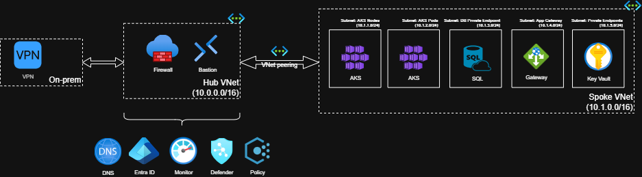

# Secure Azure Landing Zone with AKS Baseline

This project demonstrates how to build a **secure Azure landing zone** using a **hub-and-spoke network topology** with a **private AKS cluster** and integrated services such as Azure SQL Database, Key Vault, and centralized monitoring.

The setup follows Microsoft's **Cloud Adoption Framework (CAF)** and **AKS Secure Baseline** best practices, implemented with **Terraform**.

## Architecture Overview



- **Hub VNet**
  - Azure Bastion for secure admin access
  - Optional Azure Firewall for traffic control
  - Connectivity to on-premises or other spokes

- **Workload Spoke VNet**
  - **AKS Cluster** (private, Entra ID integrated, workload identity)
  - **Azure SQL Database** with private endpoint
  - **Application Gateway (WAF)** for ingress
  - **Azure Key Vault** for secrets management

- **Cross-cutting Services**
  - Azure Policy guardrails (region restrictions, tag enforcement, no public IPs)
  - Centralized logging & monitoring via **Azure Monitor + Log Analytics**

## Setup Instructions

### 1. Prerequisites
- [Terraform CLI](https://developer.hashicorp.com/terraform/downloads)
- [Azure CLI](https://learn.microsoft.com/en-us/cli/azure/install-azure-cli)
- An Azure subscription with **Owner** or **Contributor** + **User Access Administrator** rights
- SSH key pair (for AKS nodes, if required)

### 2. Clone Repository
```bash
git clone https://github.com/nushams/azure-secure-landing-zone.git
cd azure-landingzone-aks/terraform-modules
```

### 3. Setup variables
In addition to the code repo, it will need `.tfvars` file in the root module. Please provide the following variables:
```
display_name          = ""
password              = ""
user_principal_name   = ""
client_id             = ""
client_secret         = ""
subscription_id       = ""
tenant_id             = ""
location              = ""
private_dns_zone_name = ""
```

## References

- [Hub-Spoke Network Topology](https://learn.microsoft.com/en-us/azure/architecture/reference-architectures/hybrid-networking/hub-spoke)
- [Terraform Hub-Spoke Example](https://learn.microsoft.com/en-us/azure/architecture/example-scenario/hybrid/hub-spoke-network-terraform)
- [AKS Secure Baseline](https://learn.microsoft.com/en-us/azure/architecture/reference-architectures/containers/aks/secure-baseline-aks)